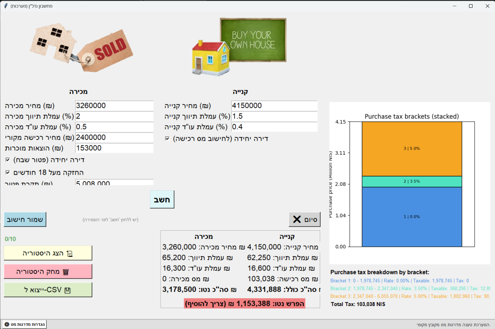

*****************************************************
               Real Estate Calculator
*****************************************************

---------------------
1. Description
---------------------
This project is a Real Estate Calculator written in Python. It provides a full calculation of real estate transactions in Israel, including purchase tax, capital gains tax, broker fees, lawyer fees, recognized expenses, and net difference between selling and buying.

The application includes:

A full GUI built with Tkinter

Tax brackets loaded from a local JSON configuration file (stable and fast)

Logic for "Single Home" vs. "Additional Home" purchase tax

Purchase tax breakdown per bracket

Graphical visualization using Matplotlib

History of up to 10 saved calculations

Export history to CSV (Excel compatible)

Support for EXE packaging via PyInstaller

---------------------
2. Features
---------------------

Capital gains tax calculation (מס שבח)

Purchase tax calculation (מס רכישה) with dual-mode support (Single/Investment)

Stacked bar chart showing purchase tax brackets

Save and view calculation history

Export calculation history to CSV file

Clear history option

Transparent tax bracket verification link

Hebrew GUI with English code documentation

EXE support with resource_path handling

---------------------
3. Technologies Used
---------------------

Python 3.10+

Tkinter

Matplotlib

JSON (Configuration)

CSV (Data Export)

PyInstaller

---------------------
4. How It Works
---------------------
The user enters sale and purchase details:

Sale price

Broker and lawyer percentages

Original purchase price

Recognized expenses

Exemption limit (Capital Gains)

New purchase price and fees

"Single Home" status for Purchase Tax (affects tax brackets)

The calculator computes:

Capital gains tax (based on exemption status)

Purchase tax (based on Single/Additional home brackets)

Total sale net

Total purchase cost

Net difference (profit or required addition)

A stacked bar chart is generated showing purchase tax brackets.

The user may:

Save the calculation

View history

Export history to CSV

Clear history

Verify tax rates via the "Settings" button

---------------------
5. Usage
---------------------

Run the file "RealEstateCalc.py" or the packaged EXE.

Fill in the fields in the GUI.

Select the checkboxes for "Single Home" (Sale) and "Single Home" (Purchase) as needed.

Click "חשב" to perform the calculation.

View results on the left (including Net Difference) and tax breakdown on the right.

Use "שמור חישוב" to save the current calculation.

Use "הצג היסטוריית חישובים" to view saved results.

Use "ייצוא ל-CSV" to save the data to an Excel-readable file.

Use "מחק היסטוריה" to clear all saved calculations.

---------------------
6. Build EXE
---------------------
To build a standalone executable (Windows), ensure you include the JSON config file:

pyinstaller --onefile --noconsole --add-data "tax_brackets.json;." --add-data "SellHouse.png;." --add-data "BuyHouse.png;." RealEstateCalc.py

The EXE will be created in the "dist" folder.

---------------------
7. Project Files
---------------------

RealEstateCalc.py : Main application code

tax_brackets.json : Configuration file for tax rates (Must be present)

SellHouse.png : Optional image for sale section

BuyHouse.png : Optional image for purchase section

README.md : Project documentation

---------------------
8. Notes
---------------------

The calculator relies on tax_brackets.json. You can update this file manually if tax rates change.

GUI labels are in Hebrew; code comments and logic are in English.

This project is intended for educational and personal use.
